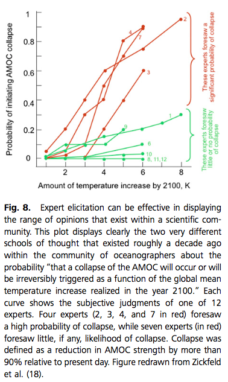

Morgan [-@Morgan:2014fn] present a review of expert elicitation methods for decision support in public policy. I reviewed this paper looking for information on how to design my methods for the expert eliciation of judgments about the consequences of particular research practices on the risk of a type I error in models used in decision support in ecology and conservation.

> I draw on relevant literature and 35 y of personal experience 
> in designing and conducting substantively detailed expert elicitations, to 
> suggest when it does and does not make sense to perform elicitations, how they 
> should be designed and conducted, and how I believe the results should and 
> should not be used. In contrast to much of the literature in Bayesian 
> decision-making and applied decision analysis, my focus is on developing 
> detailed descriptions of the state of understanding in some field of science or 
> technology.

# Article Summary

## Estimation tasks - framing the question

The upper and lower bounds should be elicited first, before asking for a best guess. This is due to cognitive heuristics and bias coming into play, chiefly, anchoring and adjustment. This is pertinent, because I will be asking experts to undertake an estimation task of the consequence of a given QRP. The process below describes elicitation of a full cumultive probability distribution. I am not yet sure whether I aim to elicit a probability distribution, or just use some 3-point elicitation technique.

> When presented with an estimation task, if people start with a first value 
> (i.e., an anchor) and then adjust up and down from that value, they typically do 
> not adjust sufficiently. Kahneman and Tversky call this second heuristic 
> “anchoring and adjustment” (37, 38). To minimize the influence of this heuristic 
> when eliciting probability distributions, it is standard procedure not to begin 
> with questions that ask about “best” or most probable values but rather to first 
> ask about extremes: “What is the highest (lowest) value you can imagine for 
> coefficient X?” or “Please give me a value for coefficient X for which you think 
> there is only one chance in 100 that actual value could be larger (smaller).” 
> Having obtained an estimate of an upper (lower) bound, it is then standard 
> practice to ask the expert to imagine that the uncertainty about the 
> coefficient’s value has been resolved and the actual value has turned out to be 
> 10% or 15% larger (smaller) than the bound they offered.

**Capturing Expert reasoning**

> We then ask the expert, “Can you offer
> an explanation of how that might be possible?” Sometimes experts can offer a 
> perfectly plausible physical explanation, at which point we ask them to revise 
> their bound.

> After obtaining estimates of upper and lower bounds on the value of 
> a coefficient of interest, we then go on to elicit intermediate values across 
> the probability distribution [“What is the probability that the value of X is 
> greater (less) than Y?”]. If results seem to be unduly scattered, changing the 
> question format may help: “Give me a value of X such that the odds that the true 
> value is greater (less) than 1 in Z (or probability P).”

> Only after filling in a number of intervening points in a cumulative 
> distribution function does one finally ask for a median or best estimate, sketch 
> the resulting distribution, and show it to the expert for their assessment and 
> possible revision.

## Question difficulty and accuracy of expert judgment - estimation aids

If we wish to obtain accurate estimates, then framing the question in a way that is 'easy' for the participant to conceptualise and quantify the estimation task is important.

> Lichtenstein et al. (41) found that probability judgments tend to be too high 
> when questions are hard, and too low when questions are easy, where “hard” and 
> “easy” questions were classified in terms of the percentage of correct answers 
> made by a reference group.

So why is a question easy or difficult to answer? We can help enable the expert to keep all factors influencing the elicited variable of interest:
This cognitive heuristic is termed 'availability'. 

We want to minimise the impact of this heuristic on the experts ability to quantify their best-considered judgment. We can do so by using graphical aids, for example:

> The best experts have comprehensive mental models of all of the various factors 
> that may influence the value of an uncertain quantity, as well as which of those 
> factors most contribute to its uncertainty. However, not all of that knowledge 
> may be comparably accessible. Because the objective of an elicitation should be 
> to obtain each expert’s best-considered judgment, it is important to help them 
> keep all of those factors in mind as they answer specific questions in an 
> elicitation. To assist in that process, we have often used a variety of 
> graphical aids such as summary tables and influence diagrams to illustrate the 
> relation between key factors that influence the value of interest. For a simple 
> example see pages 4 and 5 of the protocol used in Curtright et al. (20) 
> (available at http://pubs. acs.org/doi/suppl/10.1021/es8014088/suppl_file/ 
> es8014088_si_001.pdf).

Morgan describes a card sorting exercise, and the aim of which is to:

> differentiate between the strength of 
> influences versus sources of uncertainty, and to focus on the most important of 
> the latter in formulating their probabilistic responses.

So this should be the aim of the evidence / information we present in the elicitation survey.

> Using specialized software tools to summarize literature or construct influence 
> diagram or similar aides can also be very helpful.

But we need to be careful when interpreting the results of the elicitation... One issue with using computer tools (i.e. automated delivery of the survey) is that people spend less time, and less consideration in working out their estimates. Should consider this caveat in the discussion section.

> Such tools might be useful if used in conjunction with a face-to-face 
> elicitation. It is an open question whether experts working on their own will 
> devote the same degree of serious consideration in responding to an automated 
> elicitation system that they clearly do when responding to a well-developed 
> protocol during a face-to-face interview with attentive and technically 
> knowledgeable interviewers sitting with them in their office.

Further support for the use of graphical / information aids during elicitation:

> Most of the elicitations my colleagues and I have performed have been conducted 
> using face-to-face interviews in experts’ offices where the expert can readily 
> access relevant data and analytic and model results. In many cases, we have 
> prepared concise literature summaries or other materials and have used card 
> sorting and other tasks to encourage experts to systematically identify all 
> relevant factors that may influence a value of interest or contribute to its 
> uncertainty. Although well-informed experts obviously know and have thought 
> about all of these things, it is important to make sure that they do not 
> overlook any of them when they are asked to make quantitative judgments.

Why?

> Because experts are human, there is simply no way to eliminate cognitive bias 
> and overconfidence. The best one can hope to do is to work diligently to 
> minimize its influence. It is important to acknowledge this, brief experts on 
> the issue, and design elicitation procedures that work to achieve this 
> objective.

## Objectives of the task and expert selection

> In contrast to political or similar polling, the objective of most expert 
> elicitation is not to obtain a statistically representative sample of the views 
> of a population. Rather, it is to gain an understanding of the range of 
> responsible expert judgments and interpretations across the field of interest.

**How to choose experts?**

Careful reading of the literature, discussion with experts.

> Thus, in selecting the group of experts, care must be taken to include people 
> who represent all of the major perspectives and interpretations that exist 
> within the community. This can typically be achieved by a careful reading of the 
> literature and discussion with experts who can identify the views of their 
> various peers. In the elicitations we have conducted, we have often constructed 
> tables of the experts sorted by background and technical perspective. Because we 
> have always worked with a collaborator who was expert in the field and with the 
> relevant literatures, we have not felt it necessary to use more formal 
> procedures for sorting and selecting participants.

## Approach to designing the elicitation protocol

Should be thoughtful, well-considered. Go through several iterations of development, as well as testing using non-experts and experts. (Not everyone agrees though!)

- [ ] See Knol paper.

> Writing in the specific context of elicitations done in support of environmental 
> impact assessment, Knol et al. (48) describe a seven-step approach to developing 
> and conducting expert elicitations. Despite the title (which sounds like the 
> authors might be offering a cook book) their treatment is thoughtful and 
> nuanced. It explores many of the issues discussed in the preceding paragraphs, 
> reaching broadly similar conclusions.

> Although I have argued that the development of an elicitation protocol should be 
> an iterative process, requiring considerable effort, pretesting and refining, not everyone 
> agrees. For example, Aspinall (49) argues that “the speed with which . . . 
> elicitations can be conducted is one of their advantages,” and cites a study of 
> the virulence of biological agents conducted in just 2 d “with a few days of 
> preparatory work.” I have no doubt that in this case, in a study of a very 
> focused topic with an intensive couple of days of preparation, it was possible 
> to develop a quality study. However, one needs to be careful not to encourage 
> the development of “quick and dirty” expert elicitations.

## Presenting results

**Capturing alternative schools of thought**

- [ ] It could be interesting to look at how assessment about the severity of the practice vary depending on value judgments (i.e. about whether the research practice under consideration is defensible or not).

## Combining Expert Judgments

When considering if and how to aggregate, it's important to consider that some participants may have different underlying causal models informing their estimates, and so should not be combined:

> While Cooke’s method has been used in a number of applications (8, 49), it is 
> potentially problematic in situations, such as the assessment of health damage 
> functions or various quantities in climate science in which different experts 
> make very different assumptions about the nature of the underlying causal 
> mechanisms. As noted above, depending on how the results will be used, combining 
> the judgments of experts (by any procedure) may not be appropriate. It would 
> also be problematic if one were to exclude some experts who represent plausible 
> but poorly represented alternative views about the science. The history of 
> science is replete with examples in which the minority opinion about uncertain 
> science ultimately proved to be correct.

In the case of the QRP study... the underlying conceptual models refer BOTH to the model / scenario used in the survey, the interpretation of that information by the survey participant, and also their understanding of research practice and its influence on the model output / result at hand.

# QRP Elicitation Protocol Development Tasks

*Elicitation Protocol design*

- Articulate the objective/s of the elicitation
- Specify the quantity being estimated
- How to frame the question (influenced by the quantity being estiamted, as well as potential cognitive biases and heuristics coming into play)

*Results and analysis*

- How to aggregate across individuals (determined by the objectives... characterise schools of thought across body of researchers?)
- How to present results graphically? (schools of thought, aggregation across researchers?)

# References

- Lichtenstein
- knol: Example of how to select experts in systematic manner.
